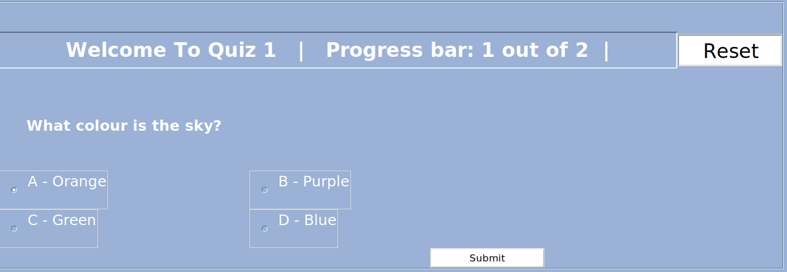
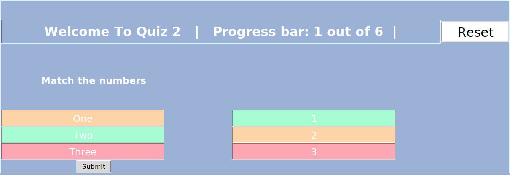
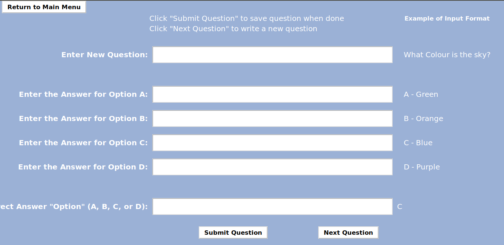
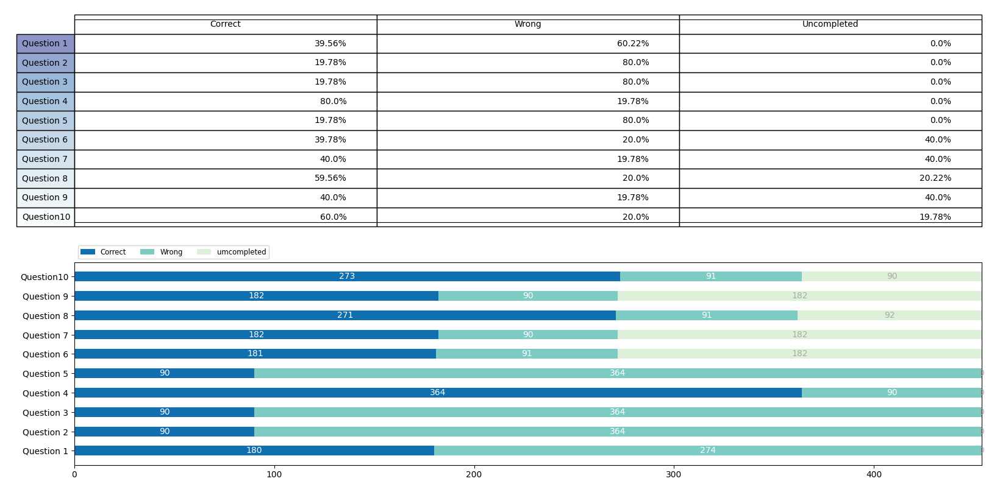

# Playing Quiz

### please install the following packages:

```
1. tkinter
2. numpy
3. matplotlib
```
### Open the terminal in the root directory and input the following(python3):
```
python display.py
```
## Results

quiz buttons get disable when you start playing quiz

To play again press "Re-Activate quiz" button which will enable the quiz button , reset the score, and reset the progress bar to "1 out of 5"


after clicking on reset button, press "Re-Activate quiz" button to enable the quiz button.
it displays total score at the end of the each quiz.

### Adding new question


### Statistics
all the results store in the " dataset_results.csv".

